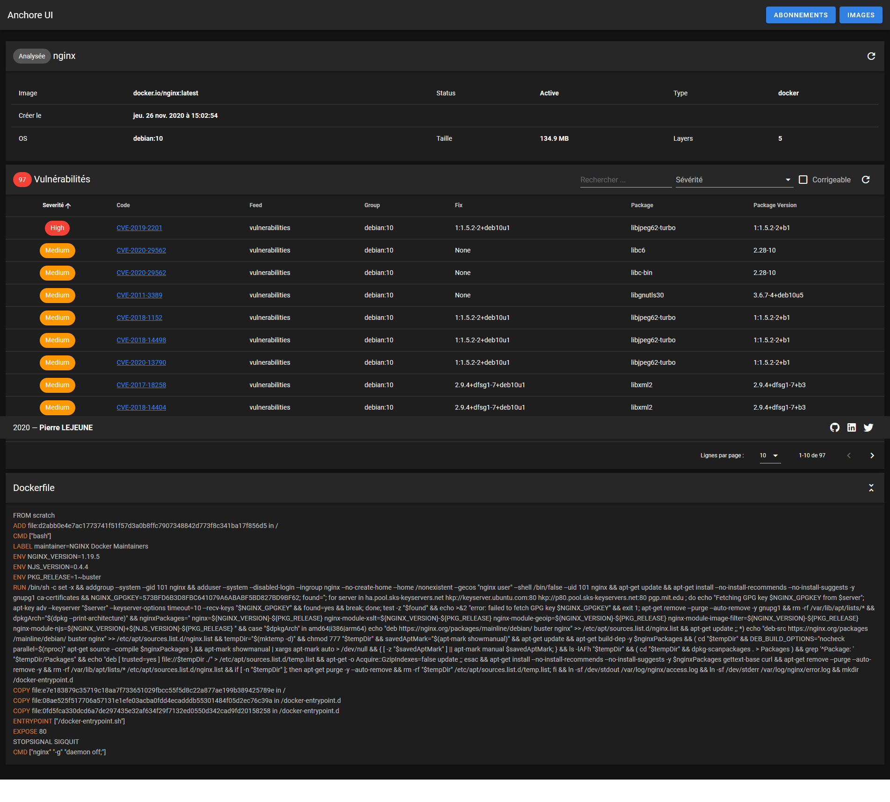

darkanakin41/ddb-anchor
===
This project have been generated with [darkanakin41/project-toolbox](https://github.com/darkanakin41/project-toolbox)

It is a [ddb](https://github.com/gfi-centre-ouest/docker-devbox-ddb) implementation of [Anchore Engine](https://github.com/anchore/anchore-engine)

It grants a ready to use ddb environment for Anchore.

# A simple GUI (WIP)
Also, a GUI have been developed in order to manage repository and display security report of docker images. 



It is still under development, but the basic functionalities are in. 

## TODO
* Add an authentification system
* Add registry management
* Build an image with sources compiled

# Useful commands
Check feeds list (vulnerability database update): 
```shell script
anchore-cli system feeds list
```

Registry Authentication: 
```shell script
anchore-cli registry add --registry-type <registry> <username> <password>
```

Image management
```shell script
anchore-cli repo add <your-repo> # Add repo to watch
anchore-cli image list # Check image list
anchore-cli image add <your-image> # Image addition
anchore-cli image content <your-image> # Image content
anchore-cli image vuln <your-image> all # Image vulnerabilities
anchore-cli evaluate check <your-image> # Evaluate image security
```

